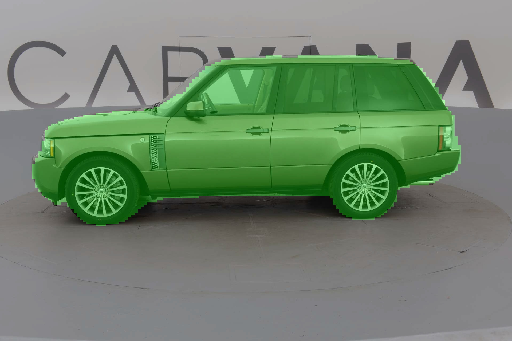

# MicroNet-Cpp: High-Performance Embedded AI Inference Engine


> *Figure 1: U-Net Semantic Segmentation Result (C++ Inference, Dice Score 0.98)*

## 📖 Introduction
**MicroNet-Cpp** is a lightweight, zero-dependency deep learning inference framework written in pure **C++17**. 

Unlike standard frameworks (PyTorch/TensorFlow) or heavy deployment libraries (TensorRT/OpenVINO), MicroNet-Cpp implements core operators **from scratch**. It is designed for deep understanding of neural network mechanics and deployment on resource-constrained embedded systems (e.g., **RISC-V K230**, ARM Cortex-A).

## ✨ Key Features
*   **Zero Dependency**: Only depends on `OpenCV` (for image IO) and `Standard C++ STL`. No `torch`, no `onnxruntime`.
*   **Hand-Crafted Operators**: 
    *   `Conv2d` (with Bias fusion support)
    *   `MaxPool2x2` / `Upsample2x` (Nearest Neighbor)
    *   `Concat` (Channel-wise memory alignment)
    *   `Sigmoid` / `ReLU` (In-place optimization)
*   **Model Support**:
    *   **YOLOv8**: Supports Anchor-Free decoding, DFL (Distribution Focal Loss) integral, and NMS.
    *   **U-Net**: Supports Skip-Connection memory management and pixel-level segmentation.
*   **Cross-Platform**: Tested on Windows (MSVC), Linux (GCC), and **RISC-V (Musl-GCC)** cross-compilation environments.

## 🛠️ Build & Run

### Prerequisites
*   CMake >= 3.10
*   OpenCV >= 4.x (Tested on 4.10.0)
*   C++17 Compiler (GCC/Clang/MSVC)

### Compilation
```bash
mkdir build && cd build
cmake ..
make -j4